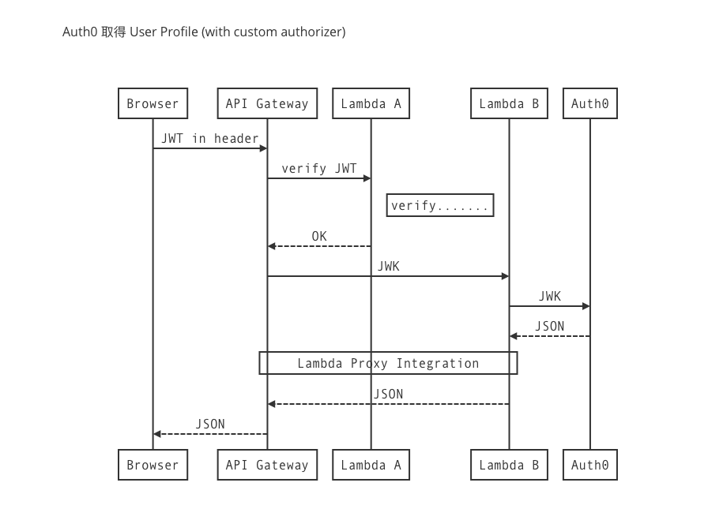

autoscale: true
build-lists: true
slidenumbers: true
theme: Next

# Serverless Architectures on AWS
## Chapter 7 API Gateway

^ 自我介紹，說明今天分享的流程

---

[.build-lists: false]

### Previously
## Ch1. Going serverless

Principles :

- Use compute service
- Write single-purpose stateless functions
- Event-driven
- More powerful frontend
- Embrace 3rd party services

^ 雲端服務的興起對 IT 基礎建設和軟體開發有很大的衝擊。
本章介紹了 serverless 和傳統架構的比較，並非都沒有缺點，

---

[.build-lists: false]

### Previously
## Ch2. Architechures and patterns

- Use cases
- Architectures
    - Compute as back end
    - Compute as glue
- Patterns
    - Messaging pattern
    - Fan-out pattern

^ 介紹 use case、
架構、
pattern，

^ Compute as backend => 使用 serverless 的 Lambda/function 和 3rd 做後端開發
Compute as backend 的目標之一是不需要把所有事情都藏在後端，前端在考慮到安全性之下也可以直接跟 service db 溝通。

^ Compute as glue 在講 pipeline workflow，大隊接力。

^ 在真的開始做產品前可以多參考現實的已知範例。
使用 SQS SNS 做 message pattern 或 fan-out pattern
(實際成功案例的經驗十分值得參考)

---

[.build-lists: false]

### Previously
## Ch3. Building a serverless application

- IAM
- S3
- Elastic Transcoder
- Lambda
- SNS & multiple subscriber

^ 正式進入 AWS console

^ (先講 list 再講 24h 應用)
24Hour Video

^ 上傳影片、轉檔、轉成功發通知信、產生影片 meta data、將影片設定為 public read

---

[.build-lists: false]

### Previously
## Ch4. Setting up your cloud

- Security
- Log
- Alert
- Billing

^ IAM 有 group, role, policy, permission

^ 用 cloudWatch 看 log，S3 也可以自動記 log

^ billing 成本控管成本預估、監控

---

[.build-lists: false]

### Previously
## Ch5. Authentication and authorization

- JWT
- Auth0
- **24Hour Video** website
- Delegation token
- Custom authorizer

^ 認證和授權

^ 會員才可以享用 24Hour Video 的功能

^ Login -> API Gateway -> Lambda -> get-user-info

---

[.build-lists: false]

### Previously
## Ch6. Lambda the orchestrator

啟動模式：

- Event ( push & pull )
- Request

^ Event (aws)

^ Request (api gateway、console、cli)

---

[.build-lists: false]

### Previously
## Ch6. Lambda the orchestrator

運行模式 :

- Waterfall
- Series
- Parallel

^ npm Async

---

[.build-lists: false]

### Previously
## Ch6. Lambda the orchestrator

Lambda 設定 :

- Version
- Alias
- Environment variable

^ Alias => Dev, Stg, Prod

---

[.build-lists: false]

### Previously
## Ch6. Lambda the orchestrator

- AWS CLI
- Local testing

^ npm : Mocha、Chai、Sinon、Rewire
for Testing、TDD、Mock

---

## This chapter covers

- Creation and management API Gateway resources and methods
- Lambda Proxy integration
- API Gateway caching, throttling, and logging

^ Resource & Method 後面會補充
以最簡單的方式串接 API Gateway 和 Lambda

---

## 回顧到目前的實作

1. (Uploading to S3)
2. Elastic Transcoder, output to another S3
3. Send notification
4. Generate meta data
5. Set permission
6. Auth0
7. Get video list

---

## Demo

^ 目前省略了書中
使用 SES 發送 email
測試 API Gateway 存取限制是否有效

^ get-video-list

^ Auth0 JWT

^ user-profile

---
​
​

---

​

---

​

^
Proxy resource & CORS
Proxy integration V.S. manual mapping

---

## Integration with AWS services

1. Lambda function
2. HTTP
3. AWS Service
4. Mock

^ 介紹 API gateway 的 整合(使用方法) 跟 特色 這兩個項目
在新增 api 時，可以選擇四種 integration type

^ 1.前面 demo 有用到，api gateway 接 lambda，收到 request 後再執行設定的 lambda

^ 2.可在 request forward 到 endpoint 之前加料, 標準的 http method 都有支援

^ 3.把 request 直接 forward 到 aws services，http method 可以直接對應到 service 的行為，例如在 DynamoDB 新增資料

^ 4.不必再串接其他服務，讓 API Gateway 直接回傳定義好的 response

---

## Features of the API Gateway

1. Caching (做快取)
2. Throttling (控制流量)
3. Logging (紀錄 log)
4. Staging (建環境別)
5. Versioning (建版本別)
6. Scripting (腳本化)

^ 快速帶過，下面再細講

---

## Caching

- 減少 latency 等待時間
- 分擔後端 loading

---

^ 可以設定 0.5 GB ~ 237 GB (每小時計費，0.5 GB: \$0.020 / hour，237GB: \$3.800 / hour)

^ 可以設定 TTL (time-to-live) 秒數

---

## Throttling

- 可限制後端每秒被呼叫的次數
- 可預防阻斷式攻擊 (denial-of-service attacks)

---

^ 可以設定 rate and burst limit

^ rate: 允許每秒被呼叫的平均次數，書1000，官網10000

^ burst limit: 允許被呼叫的最大次數，書2000，官網5000
想要增加 default 值可以跟 AWS 要

^ 書: 一個 AWS 帳戶可以設定 API Gateway 的 steady-state request rate to 1000 requests per second (rps) and allows bursts of up to 2000 rps across all APIs, stages, and methods

---

## Logging

- 可以使用 CloudWatch 紀錄 request and response

^ 可以追查像是 cache hits & misses 的資訊

---

^ API Gateway 建議都設置 CloudWatch Logs and CloudWatch Metrics

^ 設置剛提到的那兩項還需要設定 IAM 權限

---

## Staging

- 建立環境別，例如 development、UAT、production
- 每個 API 可以有十個環境別、每個帳號可以有 60 個 API
- API 可同時佈署不同的環境別，各自有自己的 URL
- 可以設定 stage variable，就像環境變數
- 設定好以後這樣用 `${stageVariables.<variable_name>}`

^ API gateway 根據不同環境設定的 stage variable 去呼叫不同的 lambda function 或 http endpoint

---

---

---

## Versioning

- 每次佈署 API 都會產生一個新的 version
- 版本切換容易

^ 這次上的版本有問題，可以透過 Deployment 的歷史紀錄介面來快速的切回上一版

---

^ 選擇想要切換的版本，點選後會出現切換的按鈕

---

## Scripting

- 整合 Swagger 服務，把 API 腳本化
- 容易 export / import
- [DEMO](https://app.swaggerhub.com/apis/guitarbien6/ooxx/1.0.0)
- 官網: https://swagger.io
- 官網教學: https://swagger.io/getting-started-with-the-amazon-swagger-importer/

^ 書中介紹了 Swagger 這個服務，AWS 有跟 Swagger 整合，在 create api 的時候可以選擇匯入 Swagger 的 script 來產生 api，也有一個選項是 example api，也是用 Swagger 的範例 script 來產生 example api

---

## Q & A